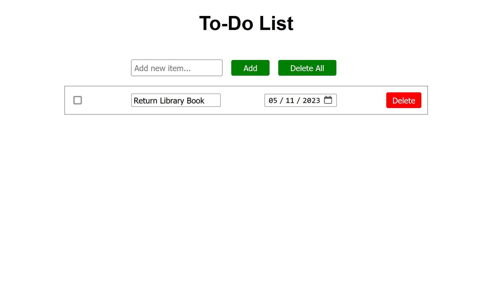

# Brief Description
A simple to do list web page (front end) written in:
- HTML
- CSS
- JavaScript

[Access site here (github pages)](https://otherfutures.github.io/simple-to-do-list/src/)

# Longer Description
Has the following capabailities:
- Add entries via Add button or Enter key
- Add date to entru
- Delete all entries
- Delete one entry
- Check/uncheck entry if desired
- Saves entries to local storage (entries will persist after page refreshes)

# Preview Image:

